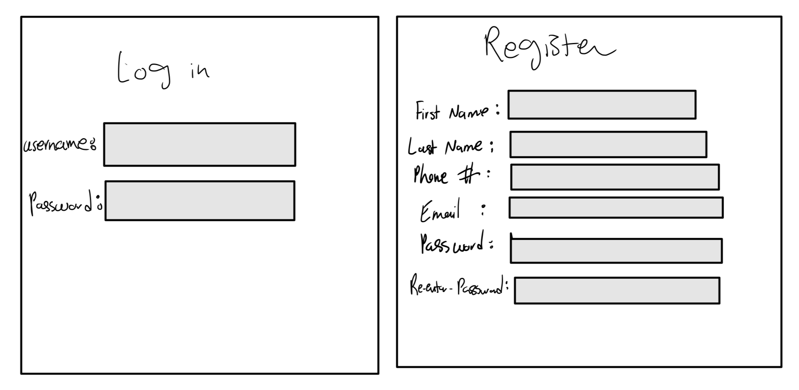
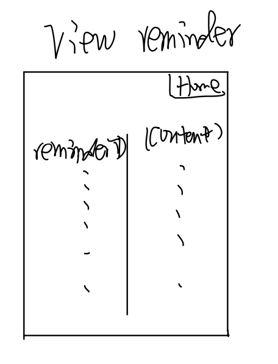

# Tether

## Table of Contents

1. [Overview](#Overview)
2. [Product Spec](#Product-Spec)
3. [Wireframes](#Wireframes)
4. [Schema](#Schema)

## Overview

### Description

**Tether** is a relationship management app designed to help users maintain regular communication with their friends, family, and social connections by setting customizable reminders. Users can add contacts, specify how often they’d like to be reminded to reach out (e.g., weekly, monthly), and track communication history. The app ensures that no connection is overlooked by sending timely reminders based on the user's preferences, fostering more meaningful relationships through regular communication.

### App Evaluation
   - **Category:** Social & Personal Management
   - **Mobile:** Tether leverages mobile technology to provide users with a simple, seamless way to manage their personal relationships on the go. The app is accessible from smartphones, enabling users to quickly add contacts, set reminders, and check their communication history. Push notifications remind users when it’s time to reach out to specific contacts, ensuring consistent engagement.
   - **Story:** Tether empowers individuals to stay connected with their social circle, offering a tool that helps manage relationships in an increasingly busy world. Whether maintaining family ties, keeping in touch with friends, or nurturing professional connections, Tether acts as a personal assistant, reminding users to check in and strengthen their bonds.
   - **Market:** Tether caters to a broad range of users—from people with large social networks to those who simply want to stay closer to their family. It appeals to anyone looking to improve personal relationships by fostering more consistent communication. Users can be professionals managing client relationships, busy parents trying to stay in touch with extended family, or even college students trying to balance social interactions.
   - **Habit:** Users form a habit of regularly checking Tether to view upcoming reminders and manage their contacts. The app encourages users to interact more frequently with their social circle by sending notifications that prompt engagement. Users can update communication preferences, adjust reminder settings, and log communication history to reflect their efforts in maintaining connections.
   - **Scope:** Tether's development roadmap includes enhanced features such as integration with messaging platforms, sentiment analysis on communications to track relationship health, and advanced options for group communication reminders (e.g., family chats or friend groups). Future milestones include features like automatic reminders for special occasions (birthdays, anniversaries) and an analytics dashboard to visualize user interactions.

## Product Spec

### 1. User Stories (Required and Optional)

**Required Must-have Stories**

* Add contact with reminders: Users can add contacts (name, phone number, email) and set up customized reminders to reach out based on their preferences (daily, weekly, monthly).
* View and manage contacts: Users should be able to view their entire list of contacts, including details like when they last communicated and the next reminder.
* Modify reminder frequency: Users can adjust the frequency of reminders for each contact, allowing flexibility based on changing relationship needs.
* User registration and authentication: New users can create an account with basic information, while existing users can log in securely to access their data.
* Receive notification reminders: The app sends notifications reminding users to reach out to contacts based on their set frequency, ensuring no connection is forgotten.

**Optional Nice-to-have Stories**

* Automatic event reminders: The app can integrate with calendar systems to automatically remind users of important dates, such as birthdays and anniversaries.
* Sentiment tracking: After each communication, users can rate the quality of the interaction (positive, neutral, negative) to analyze relationship health over time.
* Group reminders: Users can set up reminders for group communication, helping them stay in touch with multiple people at once (e.g., family groups, friend circles).
* Multi-platform integration: Integration with platforms like WhatsApp, SMS, or email to send messages directly from the app.
* Analytics and insights: The app can provide insights into communication habits, showing users who they connect with most and when they’re at risk of losing touch with others.
* In-app purchases: Premium features such as unlimited contact reminders or advanced analytics can be offered through subscriptions or in-app purchases.

### 2. Screen Archetypes

- [ ] Login/Register
* User registration and authentication: New users can create an account, and existing users can log in securely to access their contacts and reminders.

- [ ] Dashboard/Home Screen
* Contact list and reminders: Users can view a list of all their contacts, see when they last communicated, and view upcoming reminder schedules.
* Summary of upcoming reminders: A quick overview of pending reminders so users can manage their social interactions effectively.

- [ ] Add Contact Screen
* Add contact with reminders: Users can add new contacts, set communication preferences, and define reminder schedules.

- [ ] View/Edit Contact Screen
* View and modify contacts: Users can view the details of a contact, such as when they last communicated, the reminder frequency, and other details like phone number and email.
* Delete contact: Users have the option to remove a contact and associated reminders.

- [ ] Reminder Notifications
* Pending reminders: Users receive push notifications for pending reminders and can mark them as complete after contacting the person.

- [ ] Settings/Profile Screen
* Adjust profile and reminder settings: Users can modify personal settings such as notification preferences, account details, and contact groups.

### 3. Navigation

**Tab Navigation** (Tab to Screen)

* Home/Dashboard
* Add Contact
* View/Edit Contacts
* Settings/Profile

**Flow Navigation** (Screen to Screen)

- [ ] Login/Register Screen
* => Home/Dashboard

- [ ] Home/Dashboard
* => Add Contact
* => View/Edit Contacts
* => Settings/Profile

- [ ] Notifications
* => View/Edit Contacts

## Wireframes

## Schema 

### Revised conceptual database design

### Logical database design

### Application program design
#### Function 1: Add_New_Contact_w_Reminder
- //This function adds a new contact to the user's list and sets up a reminder for reaching out. It accesses the “user_social_contact” table, “reminder” table, “reminds” table, and “refers” table
- Input: userID, contactPhoneNumber, contactFirstName, contactMiddleName, contactLastName, reminderContent, reminderFrequency, reminderFormat 
- Steps:

- (1) Insert contactPhoneNumber, contactFirstName, contactMiddleName, and contactLastName into the "User_Social_Contact" table for the given userID. 
//Adds the social contact information under the user's list of contacts. 
- (2) Insert a new entry into the "Reminder" table with reminderContent and reminderFrequency.
//Creates a reminder for this contact with the specified content (e.g., message or note) and frequency (e.g., daily, weekly, monthly). 
- (3) Retrieve the generated ReminderID for the newly inserted reminder. 
- (4) Insert an entry into the "Reminds" table with the userID, ReminderID, and reminderFormat (e.g., email, SMS).
//Associates the reminder with the user and specifies the format of the reminder notification. 
- (5) Insert an entry into the "Refers" table with the ReminderID and contactPhoneNumber. 
//Links the reminder to the contact by phone number. 
- (6) Confirm successful insertion and display the contact and reminder details to the user.

#### Function 2: Delete_Contact_Associated_Reminder
- //This function removes a contact and deletes the corresponding reminder. It accesses the “user_social_contact” table, “refers” table, “reminder” table, and “reminds” table.
- Input: userID, contactPhoneNumber
- Steps:

- (1) Query the "User_Social_Contact" table to find the contact for the given userID and contactPhoneNumber.
//Ensure the contact exists in the user's social contact list.
- (2) Query the "Refers" table using contactPhoneNumber to retrieve the associated ReminderID.
- (3) Delete the associated reminder from the "Reminder" and "Reminds" tables using ReminderID and userID.
//Remove any reminder linked to this contact for the user.
- (4) Delete the contact from the "User_Social_Contact" table using the contactPhoneNumber and userID.
 //Remove the contact from the user's list.
- (5) Confirm successful deletion and notify the user that no further reminders will be sent for this contact.

#### Function 3: Update_Reminder_Contact
- //This function updates the reminder schedule for a specific contact. It accesses the “reminder” table, “reminds” table, and “refers” table.
- Input: userID, contactPhoneNumber, newReminderContent, newReminderFrequency, newReminderFormat 
- Steps:

- (1) Query the "Refers" table using contactPhoneNumber to retrieve the associated ReminderID. 
- (2) Update the "Reminder" table to set the new Content and Frequent values for the given ReminderID.
//Modify the reminder content and frequency. 
- (3) Update the "Reminds" table to set the new Format value for the given userID and ReminderID.
//Modify the reminder format (e.g., change from email to SMS). 
- (4) Confirm successful update and display the updated reminder details to the user.

#### Function 4: View_Contacts_Reminder_Status
- //This function retrieves and displays a list of the user's contacts, along with their reminder status. It accesses the “user_social_contact” table, “refers” table, “reminder” table, and “reminds” table. 
- Input: userID
- Steps:

- (1) Query the "User_Social_Contact" table to retrieve all contacts associated with the userID. //Get the list of contacts the user has added. 
- (2) For each contact, query the "Refers" table using the contactPhoneNumber to retrieve the associated ReminderID. 
- (3) Query the "Reminder" and "Reminds" tables using the ReminderID to retrieve the Content, Frequent, and Format values.
//Gather reminder information for each contact, including the reminder content, frequency, and format. 
- (4) Display the list of contacts along with their reminder content, frequency, and next scheduled reminder.
//Show the user the full list of contacts and their reminder status.

#### Function 5: Query_Pending_Reminders
- //This function retrieves all pending reminders based on the user's set reminder schedule. It accesses the “user_social_contact” table, “refers” table, “reminder” table, and “reminds” table.
- Input: userID, currentDate
- Steps:

- (1) Query the "reminds" table using userID to retrieve all ReminderIDs for which the next reminder date is due (i.e., currentDate >= nextReminderDate). 
//Identify all reminders that are due or past due based on the current date. 
- (2) For each ReminderID, query the "Refers" table to retrieve the corresponding contactPhoneNumber. 
- (3) Query the "User_Social_Contact" table using the contactPhoneNumber to retrieve the contact details (e.g., first name, last name).
//Get the contact information for the pending reminders. 
- (4) Query the "Reminder" table to retrieve the Content and Frequent values for each pending reminder. 
- (5) Display a list of pending reminders, including the contact's name, reminder content, and next reminder date.
//Show the user the contacts they need to reach out to, along with the reminder content.

#### Function 6: Get_Tot_Num_Contacts_Reminders
- //This function aggregates data to return the total number of contacts and reminders for a user. It accesses the "user_social_contact" table and "reminds" table.
- Input: userID
- Steps:

- (1) Query the "User_Social_Contact" table to count the total number of contacts for the given userID.
//Uses COUNT() to get the total number of contacts.
- (2) Query the "Reminds" table to count the total number of reminders set for the given userID.
//Uses COUNT() to get the total number of reminders.
- (3) Display the total number of contacts and reminders to the user.
//Shows summary information to the user.
